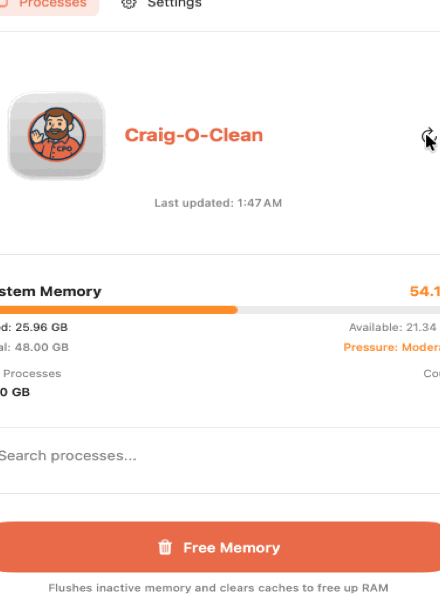

# ClearMind Control Center

<p align="center">
  
</p>

<p align="center">
  <strong>A powerful macOS utility for monitoring system resources, managing processes, and optimizing memory.</strong>
</p>

<p align="center">
  <em>Built with SwiftUI for Apple Silicon • macOS 14+ (Sonoma)</em>
</p>

---

## ✨ Features

### 📊 System Dashboard
- **Real-time monitoring** of CPU, RAM, disk, and network usage
- **Memory pressure indicator** (Normal/Moderate/High/Critical)
- **Per-core CPU visualization** with interactive charts
- **Historical data tracking** with customizable time ranges
- **System health summary** at a glance

### 📋 Process Manager
- View all running applications and system processes
- **Sort by name, CPU usage, memory, or PID**
- Filter user apps vs. system processes
- **Safe process termination** with confirmation dialogs
- **Force quit** capability for unresponsive apps
- Process details with CPU history charts
- Export process list to CSV

### 🧹 Memory Cleanup
- **Guided cleanup workflow** in three easy steps
- Intelligent suggestions based on memory usage patterns
- See estimated memory to be freed before cleanup
- Safe termination of memory-heavy apps
- Optional **memory purge** command (with admin privileges)
- Background app detection and cleanup

### 🌐 Browser Tab Manager
- **Manage tabs across multiple browsers:**
  - Safari
  - Google Chrome
  - Microsoft Edge
  - Brave Browser
- View all open tabs with URLs
- Close individual tabs or entire windows
- **Close tabs by domain** (e.g., all YouTube tabs)
- Remove duplicate tabs automatically
- Quick cleanup of heavy browser tabs

### 📱 Menu Bar App
- **Always-accessible** from the menu bar
- Live memory percentage display
- Quick system metrics overview
- **One-click optimization** actions
- Expandable to full dashboard

---

## 🖼️ Screenshots

### Dashboard


The dashboard provides a comprehensive overview of your system's health with real-time metrics.

### Process Manager
View and manage all running processes with detailed information and actions.

### Memory Cleanup
A guided workflow to safely free up memory by closing unnecessary applications.

### Browser Tabs
Manage browser tabs across Safari, Chrome, Edge, and Brave from one place.

---

## 📋 Requirements

- **macOS 14.0 (Sonoma)** or later
- **Apple Silicon** (M1, M2, M3 series) or Intel Mac
- Xcode 15.0+ for building from source

---

## 🚀 Installation

### Option 1: Build from Source

1. **Clone the repository:**
   ```bash
   git clone https://github.com/yourusername/clearmind-control-center.git
   cd clearmind-control-center
   ```

2. **Open in Xcode:**
   ```bash
   open Craig-O-Clean.xcodeproj
   ```

3. **Build and run:**
   - Select your target device (My Mac)
   - Press `Cmd + R` to build and run

### Option 2: Download Release

Download the latest `.dmg` from the [Releases](https://github.com/yourusername/clearmind-control-center/releases) page.

---

## 🔐 Permissions

ClearMind Control Center requires certain permissions to function properly:

### Required Permissions

| Permission | Purpose | How to Enable |
|------------|---------|---------------|
| **Automation** | Control browsers for tab management | System Settings → Privacy & Security → Automation |

### Optional Permissions

| Permission | Purpose | How to Enable |
|------------|---------|---------------|
| **Accessibility** | Enhanced system monitoring | System Settings → Privacy & Security → Accessibility |
| **Administrator** | Memory purge command | Prompted when using purge feature |

### How to Grant Permissions

1. **Open System Settings**
2. **Navigate to Privacy & Security**
3. **Select the permission type** (e.g., Automation)
4. **Find ClearMind Control Center** in the list
5. **Enable the toggle** for each browser you want to manage

> **Note:** You may need to restart the app after granting permissions.

---

## 🏗️ Architecture

ClearMind Control Center follows a modular architecture:

```
ClearMind Control Center
├── Services/
│   ├── SystemMetricsService    # CPU, RAM, disk, network monitoring
│   ├── ProcessManager          # Process listing and management
│   ├── MemoryOptimizerService  # Memory cleanup workflows
│   ├── BrowserAutomationService # Browser tab management
│   └── PermissionsService      # Permission checking and guidance
├── Views/
│   ├── MainAppView             # Sidebar navigation container
│   ├── DashboardView           # System metrics dashboard
│   ├── ContentView             # Process manager view
│   ├── MemoryCleanupView       # Guided cleanup interface
│   ├── BrowserTabsView         # Tab management interface
│   └── PermissionsView         # Settings and permissions
└── Tests/
    ├── SystemMetricsServiceTests
    ├── BrowserAutomationServiceTests
    └── MemoryOptimizerServiceTests
```

See [ARCHITECTURE.md](ARCHITECTURE.md) for detailed documentation.

---

## 🧪 Testing

### Run Unit Tests

```bash
# From Xcode
Cmd + U

# From command line
xcodebuild test -project Craig-O-Clean.xcodeproj -scheme Craig-O-Clean -destination 'platform=macOS'
```

### Test Coverage

- **SystemMetricsService**: Memory, CPU, disk, and network metrics
- **BrowserAutomationService**: Browser detection, tab parsing
- **MemoryOptimizerService**: Cleanup workflows, selection management

---

## 🔒 Security & Privacy

- **No data collection**: All monitoring happens locally
- **No network requests**: The app doesn't send any data
- **No analytics**: Your usage is completely private
- **Open source**: Review the code yourself

For detailed security information, see [SECURITY_NOTES.md](SECURITY_NOTES.md).

---

## 🛠️ Development

### Building

```bash
# Build for debugging
xcodebuild -project Craig-O-Clean.xcodeproj -scheme Craig-O-Clean -configuration Debug build

# Build for release
xcodebuild -project Craig-O-Clean.xcodeproj -scheme Craig-O-Clean -configuration Release build
```

### Code Style

- Swift 5.9+
- SwiftUI for all views
- Combine for reactive updates
- MainActor for UI-related services

### Contributing

1. Fork the repository
2. Create a feature branch
3. Make your changes
4. Run tests
5. Submit a pull request

---

## 📝 License

This project is licensed under the MIT License - see the [LICENSE](LICENSE) file for details.

---

## 🙏 Acknowledgments

- Apple for SwiftUI and the macOS platform
- The open-source community for inspiration
- All contributors and testers

---

## 📬 Contact

- **Issues**: [GitHub Issues](https://github.com/yourusername/clearmind-control-center/issues)
- **Discussions**: [GitHub Discussions](https://github.com/yourusername/clearmind-control-center/discussions)

---

<p align="center">
  Made with ❤️ for macOS
</p>
